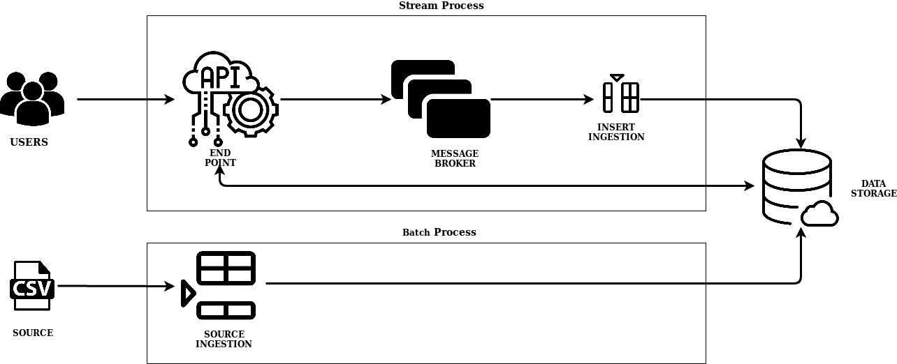

# Design report

## 1. Design and explain interactions between main components in your architecture of mysimbdp

The designed architecture is composed by different components in order to manage the different scenarios. 
It is composed mainly of two different layers. The first one is the batch process where the data ingestion of the source database can be done, it is composed by an API where 
the admin user can ingest the source file and it interact directly with the data storage. The second is the stream process, where 
the tennants request are managed. It is composed by an API end point where the user can interact and make request. After this we have an intermediary component, the message broker
that generate queues to manage publisher/supplier connection. In addition, the main benefit of the message broker rise 
when the system scale-up and new consumers need to access to the users requests, they can directly be connected to the 
message broker so there is no need to modify the API that interact with the user. Finally the message broker sent the user request to the data
storage. Between the message broker and the data storage there is a deamon program that map the message from the broker
to the data storage.

Now that the global idea is explained, we define the main thecnology and components of our system.
To implement the **mysimbdp-daas** Flask has been used. It generate an end point and the APIs that interact with the users. The APIs are made for both: general user and admin users.
We used rabbitMQ as message broker since it has easy set up and deployment as well as it has all the feature required for 
the project. To implement the **mysimbdp-coredms** mongoDP atlas has been used. In general, it provide a cloud solution
with tree clusters of mongoDB. MongoDB has been selected among the possible solutions for its easy and fast implementation. 
**mysimbdp-dataingest**

## 2. Explain how many nodes are needed in the deployment of mysimbdp-coredms so that this component can work property (theoretically based on the selected technology)
3 explain why
## 3. Will you use VMs or containers for mysimbdp and explain the reasons for each component

## 4. Explain how would you scale mysimbdp to allow a lot of users using mysimbdp-dataingest to push data into mysimbdp

## 5. Explain your choice of industrial cloud infrastructure and/or mysimbdp-coredms provider, when you do not have enough infrastructural resources for provisioning mysimbdp
