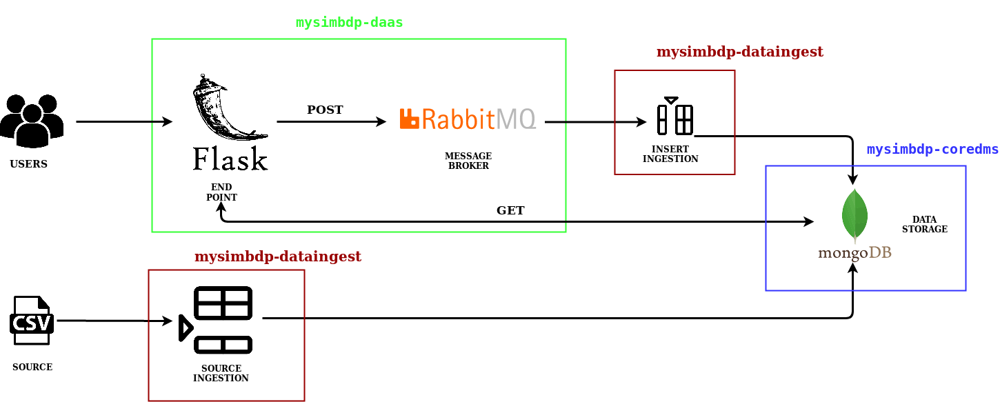

# Assignment Report - 801979

# Part 1

## 1. Design and explain interactions between main components in your architecture of mysimbdp

The designed architecture is composed by different components in order to manage the different scenarios. 
It is composed mainly of two different layers. The first one is the batch process where the data ingestion of the source database can be done, it is composed by an API where 
the admin user can ingest the source file and it interact directly with the data storage. The second is the stream process, where 
the tennants request are managed. It is composed by an API end point where the user can interact and make request. After this we have an intermediary component, the message broker
that generate queues to manage publisher/supplier connection. In addition, the main benefit of the message broker rise 
when the system scale-up and new consumers need to access to the users requests, they can directly be connected to the 
message broker so there is no need to modify the API that interact with the user. Finally the message broker sent the user request to the data
storage. Between the message broker and the data storage there is a deamon program that map the message from the broker
to the data storage.

Now that the global idea is explained, we define the main thecnology and components of our system.
To implement the **mysimbdp-daas** Flask has been used. It generate an end point and the APIs that interact with the users. The APIs are made for both: general user and admin users.
We used rabbitMQ as message broker since it has easy set up and deployment as well as it has all the feature required for 
the project. To implement the **mysimbdp-coredms** mongoDP Atlas has been used. In general, it provide a cloud solution
with tree clusters of mongoDB. MongoDB has been selected among the possible solutions for its easy and fast implementation. 
**mysimbdp-dataingest** is composed by two different components. The first one is a Script that can be lounched
to push a source into the data storage, in our case a CSV file. The second compenent is a deamon that receive
messages from the broker and push them into the data storage.

The previous figure represent the implemented structure. First of all the admin user can import the sources using the source ingestion script
that is directly connected with mongoDB. MongoDB Atlas provide a cloud solution where I have created a cluster of 3 nodes where all the 
data are stored and replicated. Afterwords, the users can interact with the Flask end point and make POST/GET request.
In the case of POST requests, they are forwarded to the queue(RabbitMQ). In the case of GET requests they are forwarded directly to
the mongoDB data storage.

## 2. Explain how many nodes are needed in the deployment of mysimbdp-coredms so that this component can work property (theoretically based on the selected technology)
3 explain why
## 3. Will you use VMs or containers for mysimbdp and explain the reasons for each component
In opinio of Andrea the system for big data process had hoop they are not good in container, effimera memoria 
Non virtualizzerei i container
## 4. Explain how would you scale mysimbdp to allow a lot of users using mysimbdp-dataingest to push data into mysimbdp

## 5. Explain your choice of industrial cloud infrastructure and/or mysimbdp-coredms provider, when you do not have enough infrastructural resources for provisioning mysimbdp

# Part 2

## 1. Design and explain the data schema/structure for mysimbdp-coredms
## 2. Explain how would you partition the data in mysimbdp-coredms into different shards/partitions
## 3. Write a mysimbdp-dataingest that takes data from your selected sources and stores the data into mysimbdp-coredms
## 4. Given your deployment environment, show the uploading performance (response time and failure) of the tests for 1,5, 10, .., n of concurrent mysimbdp-dataingest pushing data into mysimbdp-coredms
## 5. Observing the performance and failure problems when you push a lot of data into mysimbdp-coredms (you do not need to worry about duplicated data in mysimbdp), propose the change of your deployment to avoid such problems (or explain why you do not have any problem with your deployment)

# Part 3
## 1. Assume that each of your tenants/users will need a dedicated mysimbdp-coredms. Design the data schema of service information for mysimbdp-coredms that can be published into an existing registry (like ZooKeeper, consul or etcd) so that you can find information about which mysimbdp-coredms for which tenants/users.
## 2. Assume that the service information about mysimbdp-coredms for a tenant/users is in a file, write a program that can be used to publish the service information of mysimbdp- coredms into either etcd, consul or Zookeeper 
## 3. Explain how you would change the implementation of mysimbdp-dataingest (in Part 2) to integrate a service discovery feature (no implementation is required) 
## 4. Explain APIs you would design for mysimbdp-daas so that any other developer who wants to implement mysimbdp-dataingest can write his/her own ingestion program to write the data into mysimbdp-coredms by calling mysimbdp-daas (1 point)
## 5. Assume that now only mysimbdp-daas can read and write data into mysimbdp-coredms, how would you change your mysimbdp-dataingest (in Part 2) to work with mysimbdp- daas 

